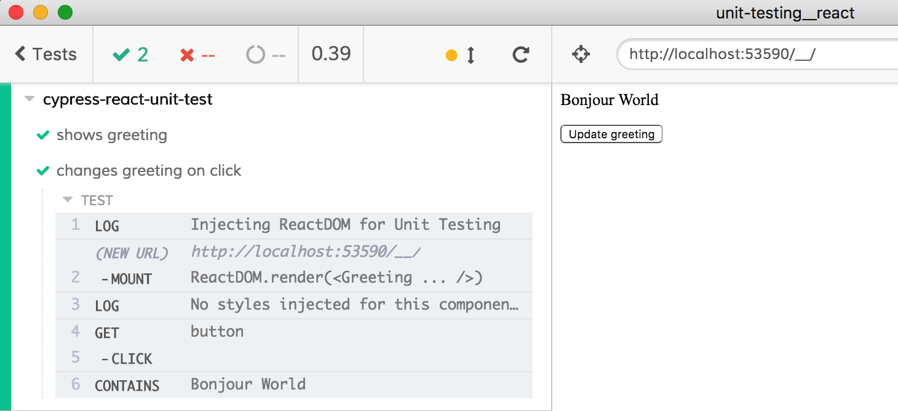

# Unit testing React code

A little React [greeting.jsx](greeting.jsx) component is tested (inside Cypress test runner) using:

- [cypress/integration/enzyme-spec.js](cypress/integration/enzyme-spec.js) using [Enzyme](https://airbnb.io/enzyme/)
  * import `enzyme` from `node_modules`.
  * extend chai assertions with [`chai-enzyme`](https://github.com/producthunt/chai-enzyme).
- [cypress/integration/react-testing-library-spec.js](cypress/integration/react-testing-library-spec.js) using [react-testing-library](https://github.com/kentcdodds/react-testing-library)
- [cypress/component/cypress-react-unit-test-spec.js](cypress/component/cypress-react-unit-test-spec.js) using [cypress-react-unit-test](https://github.com/bahmutov/cypress-react-unit-test)

The screenshot below shows how [cypress-react-unit-test](https://github.com/bahmutov/cypress-react-unit-test) mounts a React component as "mini" web application.

Name | Description
--- | ---
[cypress-react-unit-test-spec.js](cypress/component/cypress-react-unit-test-spec.js) | Simple button click
[counter-spec.js](cypress/component/counter-spec.js) | Testing a counter component that uses React hook

## Quick Start
